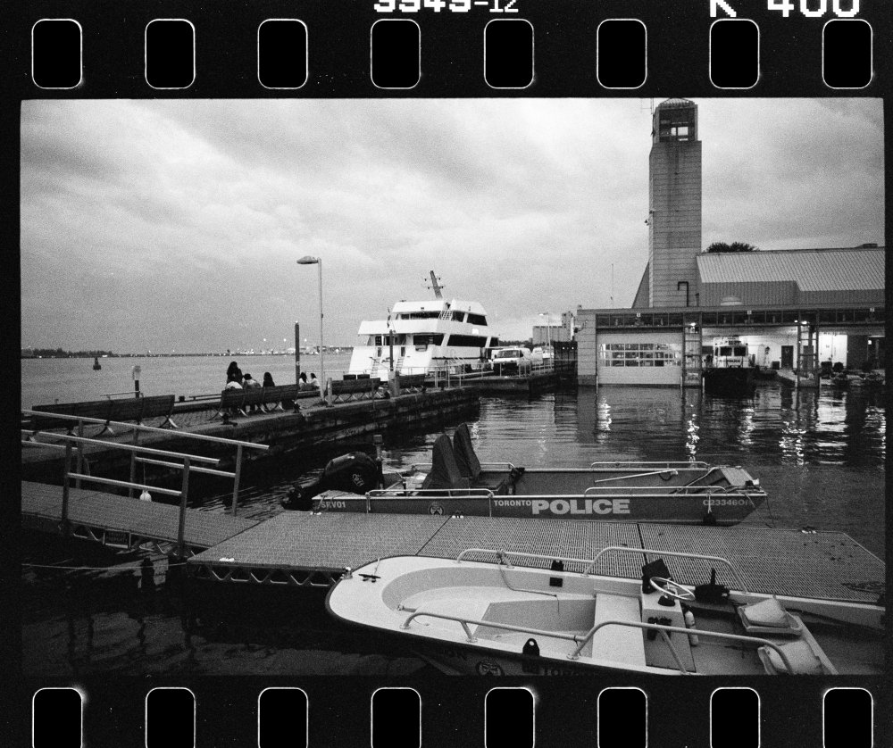
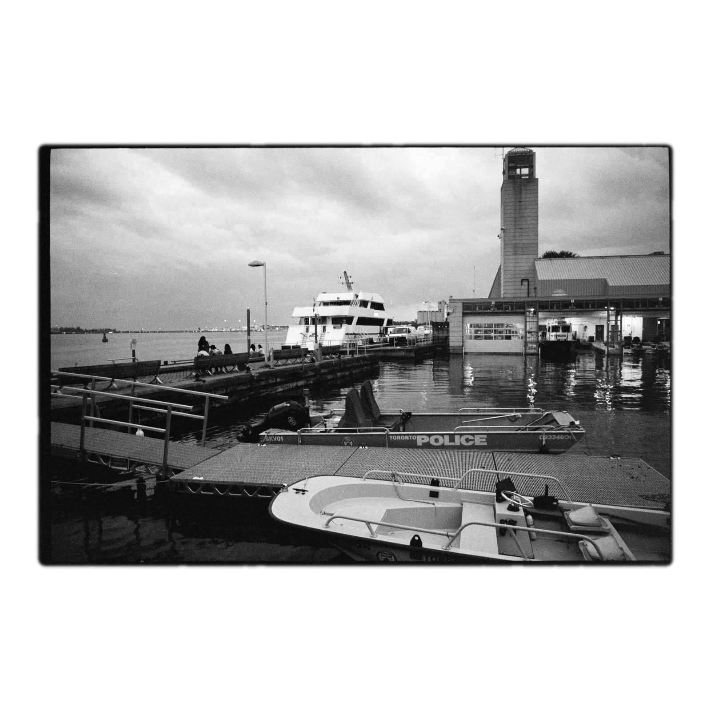
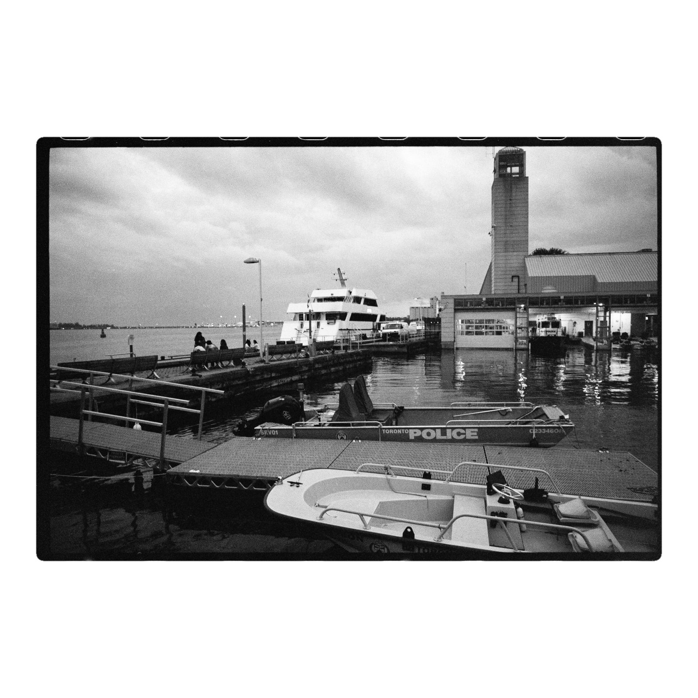
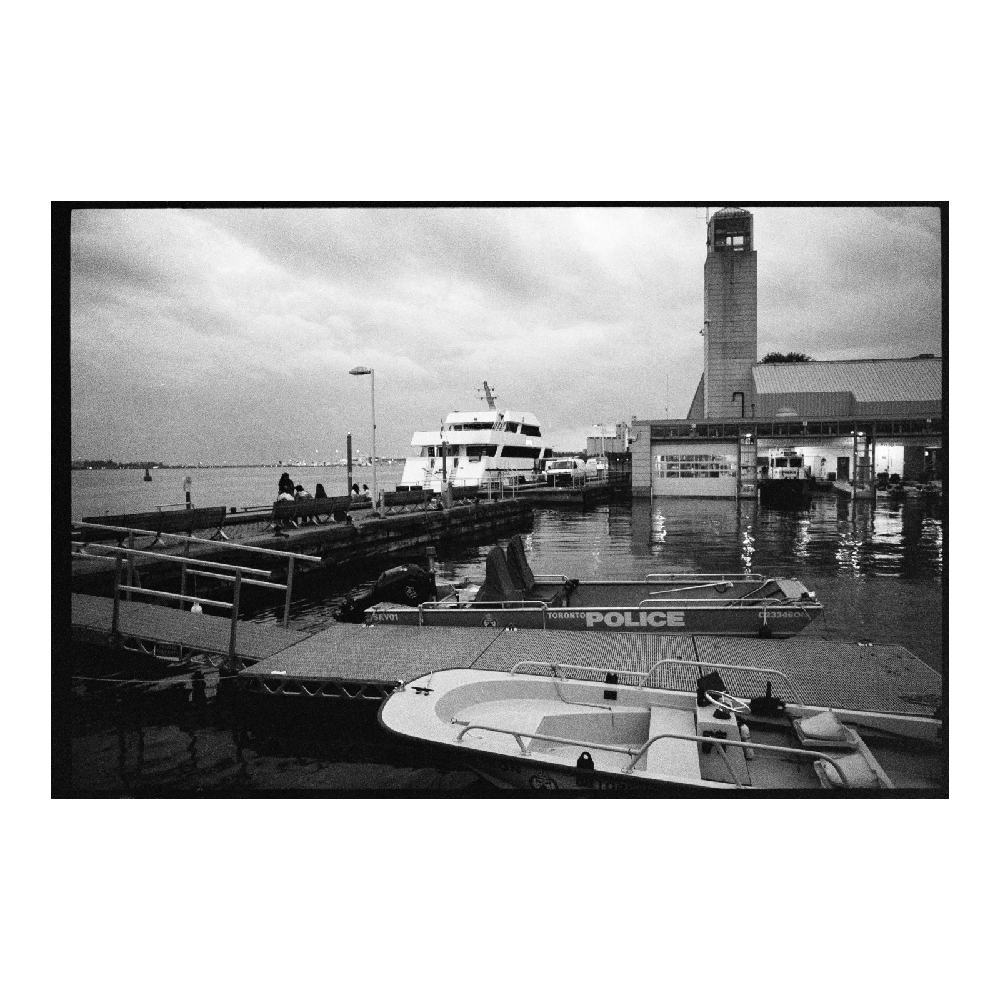
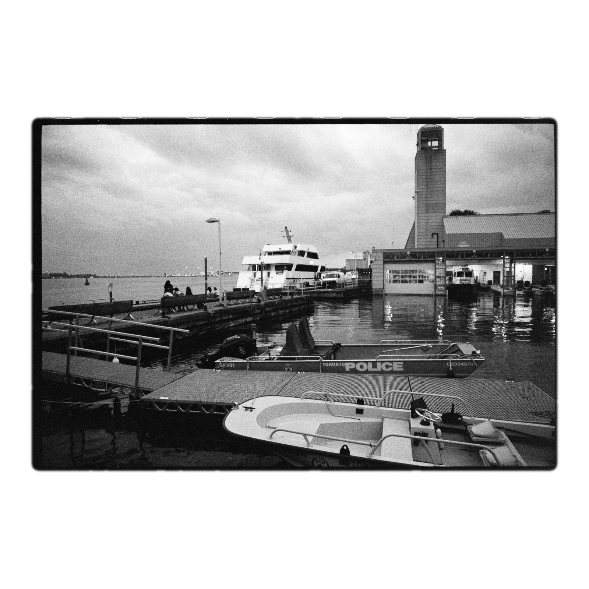
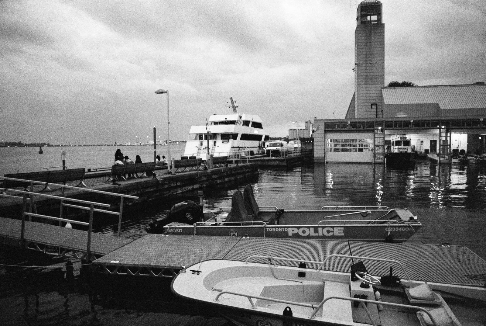

# Film border scanner

Takes DSLR scans of 35mm film shot "with full sprockets" (already-positive /
inverted) and produces bordered scans: the real frame + its natural film
rebate border, rounded corners with soft/irregular edges, on a white canvas.

The look mimics the classic Fuji Frontier "border" scan (frame + unexposed
film border on white), but it's built from the real border in your scan rather
than a drawn frame.

By default the output is at **native resolution** (no resampling, no quality
loss) — typically ~6300x4500px.

## Examples

Input (full-sprocket DSLR scan) and what the tool produces:

| Input | Output (default) |
|---|---|
|  |  |

Variations on the same scan:

| Natural (3 random seeds) | Extremes |
|---|---|
|  |  |
|  |  |
|  | |

Left column: default bordered look (each row is a different `--seed`).
Right column: sprocket slivers forced (`--sprocket-chance 1`) and no
rounding/no texture (`--radius 0 --roughness 0 --feather 0`).

## Run

The script is executable and pins `/opt/homebrew/bin/python3.11` (which has
OpenCV + numpy — the default `python3` on this Mac is 3.14 and does not):

```bash
./border_crop.py /Users/weslleyaraujo/Desktop/frontier-border/bar/*.jpg --out ./out
```

Single file:

```bash
./border_crop.py SAMPLE.jpg --out ./out --debug
```

Or explicitly:

```bash
/opt/homebrew/bin/python3.11 border_crop.py SAMPLE.jpg --out ./out
```

## Options

| flag          | default         | meaning                                                  |
|---------------|-----------------|----------------------------------------------------------|
| `--out`       | `.`             | output directory                                         |
| `--size`      | `0`             | square canvas size; `0` = native resolution (recommended)|
| `--margin`    | `0.05`          | white margin around the crop (fraction)                  |
| `--border`    | `0.012`         | film border kept around the gate (fraction of gate height)|
| `--radius`    | `0.015`         | corner radius (fraction of final crop size)              |
| `--radius-jitter` | `0.25`       | random +/- variation of corner radius (fraction)         |
| `--roughness` | `0.5`           | edge irregularity in px (0 = perfectly straight)         |
| `--feather`   | `2.5`           | edge softness in px (0 = hard edge)                      |
| `--sprocket-chance` | `0.5`      | chance (0-1) a tiny sliver of sprockets is visible, per side (top/bottom) |
| `--seed`      | random          | random seed for edge texture (for reproducibility)       |
| `--quality`   | `100`           | JPEG quality 1-100                                       |
| `--plain`     | off             | crop just the 3:2 image, no border, no white canvas      |
| `--debug`     | off             | also save an annotated debug image                       |
| `--suffix`    | `.bordered.jpg` | output filename suffix (use `.png` for lossless)         |

## Plain crop (no border)

Add `--plain` to output just the 3:2 image with no film border and no white
canvas (at native resolution):

```bash
./border_crop.py .../*.jpg --out ./out --plain --suffix .plain.jpg
```



## Portrait / vertical shots

Works as-is. A 35mm frame is always 36x24mm (landscape) in the scan, so the
script always crops the landscape frame correctly even if the photo inside was
shot vertically — the content is just rotated 90° within the frame. Rotate the
final image afterwards if you want to view it upright.

## How it works

1. Finds the sprocket holes (bright blobs at the film's top/bottom edges) and
   fits them to the ~4.75mm periodic grid to discard dust/photo content.
2. Gate (the 36x24mm frame) = between the top and bottom sprocket rows.
3. Horizontal centre from the sprocket holes (top/bottom cross-checked).
4. Crops the gate plus a thin band of the real unexposed film border.
5. Applies a rounded, slightly wavy, feathered edge and pastes onto a white
   canvas at native resolution.

Requires: `opencv-python-headless` and `numpy`.
